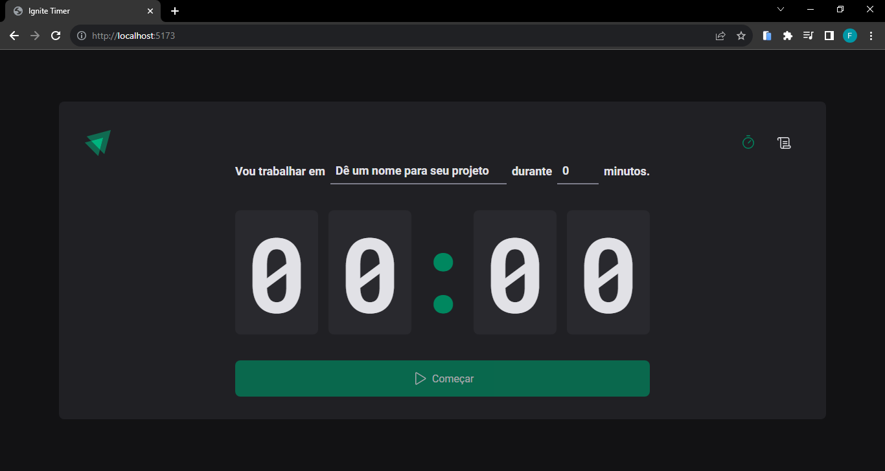

<h1 align="center">Ignite Timer</h1>

<div align="center">
  
</div>

## 1 - Sobre

Uma aplicação com o método Pomodoro para otimizar sua produtividade através de períodos de trabalho concentrado e pausas estratégicas.

## 2 - Tecnologias

Um pouco das tecnologias que foram utilizadas no projeto:

- ReactJS
- TypeScript
- Styled-Components
- Context API
- React-Hook-Form
- Zod
- React-Router-Dom
- Date-Fns

## 3 - Rodando o projeto:

Você precisa ter o [Node](https://nodejs.org/en/), o [Git](https://git-scm.com/) e algum gerenciador de pacotes([NPM](https://docs.npmjs.com/downloading-and-installing-node-js-and-npm/) | [Yarn](https://classic.yarnpkg.com/lang/en/docs/install)) instalados em sua máquina.

```bash
1. Clone o repositório:
$ git clone https://github.com/felipems1/ignite-timer.git

2. Acesse a pasta e instale as dependências via terminal:
$ yarn install / npm install

3. Inicie a aplicação em modo de desenvolvimento:
$ yarn dev / npm run dev

4. O servidor será aberto em http://localhost:5173
```

<p align="center">Projeto feito com ❤️ por <a href="https://www.linkedin.com/in/felipems12/">Felipe Moises</a></p>
